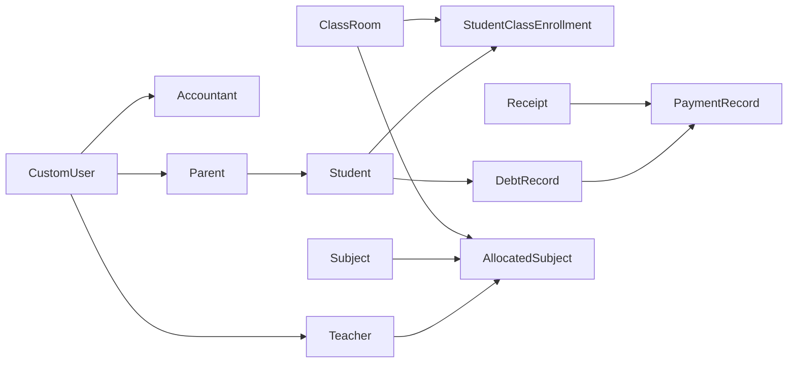

# Django SCMS - Documentation Overview

> **Comprehensive API & System Documentation**  
> Created: December 21, 2024  
> Version: 1.0

---

## 📚 Documentation Suite

This documentation package provides complete coverage of the Django School CMS system including all modules, APIs, workflows, and implementation guides.

### Available Documents

| Document | Description | Pages |
|----------|-------------|-------|
| **[COMPLETE_API_DOCUMENTATION.md](./COMPLETE_API_DOCUMENTATION.md)** | Full API reference with all 9 modules, endpoints, examples, and workflows | ~50 |
| **[MODULE_IMPLEMENTATION_GUIDE.md](./MODULE_IMPLEMENTATION_GUIDE.md)** | Step-by-step implementation guide for each module | ~25 |
| **[API_DOCUMENTATION.md](../API_DOCUMENTATION.md)** | Quick start API reference (existing) | ~10 |
| **[POSTMAN_API_Collection.json](../POSTMAN_API_Collection.json)** | Postman collection for testing | - |

---

## 🎯 Quick Start

### For Developers

1. **Read:** [COMPLETE_API_DOCUMENTATION.md](./COMPLETE_API_DOCUMENTATION.md) - Section 1 (Project Overview)
2. **Setup:** Follow [MODULE_IMPLEMENTATION_GUIDE.md](./MODULE_IMPLEMENTATION_GUIDE.md) - Getting Started
3. **Test:** Import [POSTMAN_API_Collection.json](../POSTMAN_API_Collection.json) into Postman
4. **Authenticate:** Use `/api/users/login/` to get JWT token
5. **Explore:** Start with Users module, then Academic module

### For Product Managers

- **System Architecture:** [Complete Docs - Section 2](./COMPLETE_API_DOCUMENTATION.md#system-architecture)
- **Module Overview:** [Complete Docs - Section 4](./COMPLETE_API_DOCUMENTATION.md#modules-overview)
- **Workflows:** [Complete Docs - Section 14](./COMPLETE_API_DOCUMENTATION.md#common-workflows)

### For Teachers/Accountants

- **Login Guide:** [Implementation Guide](./MODULE_IMPLEMENTATION_GUIDE.md#users-module-implementation)
- **Attendance:** [Complete Docs - Section 9](./COMPLETE_API_DOCUMENTATION.md#attendance-module)
- **Finance:** [Complete Docs - Section 11](./COMPLETE_API_DOCUMENTATION.md#finance-module)

---

## 🏗️ System Architecture Summary

### Core Modules

```
├── Users Module          - Authentication & user management
├── Academic Module       - Students, classes, subjects
├── Administration        - School settings, terms, events
├── SIS Module           - Student information system
├── Attendance Module    - Student & teacher attendance
├── Examination Module   - Exams, grades, results
├── Finance Module       - Fees, receipts, payments, debts
├── Schedule Module      - Timetables & periods
└── Notes Module         - Assignments & learning materials
```

### Technology Stack

- **Backend:** Django 3.x+ with Django REST Framework
- **Database:** PostgreSQL
- **Authentication:** JWT (JSON Web Tokens)
- **API Style:** RESTful

### Base URLs

```
Development: http://localhost:8000
API Base: /api/
```

---

## 📖 Module Quick Reference

### Users Module - `/api/users/`

**Purpose:** Manage all user types (Teachers, Accountants, Parents)

**Key Endpoints:**
- `POST /login/` - Authenticate and get JWT token
- `GET /profile/` - Get current user profile
- `GET /teachers/` - List teachers
- `POST /teachers/` - Create teacher
- `POST /teachers/bulk-upload/` - Bulk upload teachers

**Auto-generated Passwords:**  
Format: `Complex.{last 4 digits of empId}`

---

### Academic Module - `/api/academic/`

**Purpose:** Manage academic structure (students, classes, subjects)

**Key Endpoints:**
- `GET /subjects/` - List subjects
- `GET /classrooms/` - List classrooms
- `POST /student-classes/` - Enroll student in class
- `GET /departments/` - List departments

**Important Workflow:**
1. Create Departments → Subjects
2. Create ClassLevels → Streams → ClassRooms
3. Enroll Students → Auto-creates DebtRecord

---

### Finance Module - `/api/finance/`

**Purpose:** Complete financial management

**Key Endpoints:**
- `POST /receipts/` - Record fee payment
- `GET /debts/` - List student debts
- `POST /payments/record/` - Link receipt to debt
- `GET /students/{id}/debt-overview/` - Get debt summary

**Key Workflow:**
1. Student enrolled → DebtRecord auto-created
2. Parent pays fees → Create Receipt
3. Accountant → Create PaymentRecord
4. System → Updates debt balance

---

### Attendance Module - `/api/attendance/`

**Purpose:** Track student and teacher attendance

**Key Endpoints:**
- `POST /students/` - Record student attendance
- `POST /teachers/` - Record teacher attendance
- `POST /periods/` - Record period attendance
- `GET /statuses/` - List attendance statuses

**Note:** "Present" status is NOT saved (only exceptions)

---

### Examination Module - `/api/examination/`

**Purpose:** Manage exams and grades

**Key Endpoints:**
- `POST /exams/` - Create examination
- `POST /marks/` - Submit student marks
- `GET /results/` - Get student results
- `GET /grade-scales/` - View grading system

---

### Schedule Module - `/api/schedule/`

**Purpose:** Manage timetables

**Key Endpoints:**
- `POST /periods/` - Create timetable period
- `GET /periods/?classroom=X&day_of_week=Monday` - Get timetable

---

## 🔑 Authentication Flow

```
1. POST /api/users/login/ {email, password}
   → Receive {token, user_data}

2. Add header to all requests:
   Authorization: Bearer <token>

3. Access protected endpoints
```

---

## 💡 Common Use Cases

### 1. Register New Student

```
Step 1: Create Parent (if not exists)
Step 2: Create Student
Step 3: Enroll in ClassRoom → Auto-creates debt
Step 4: Parent receives credentials
```

### 2. Process Fee Payment

```
Step 1: Parent makes payment
Step 2: Accountant creates Receipt
Step 3: System links Receipt to DebtRecord
Step 4: Debt balance updated
Step 5: Parent notified
```

### 3. Mark Daily Attendance

```
Step 1: Teacher selects classroom & date
Step 2: System fetches all students
Step 3: Teacher marks absences (Present not saved)
Step 4: Attendance report generated
```

### 4. Create Exam & Enter Marks

```
Step 1: Admin creates Examination
Step 2: Teachers submit marks per subject
Step 3: System validates marks (0 to out_of)
Step 4: Generate results with GPA
```

---

## 🔍 Key Features

### Automated Workflows

- ✅ **Auto-create CustomUser** when Teacher/Accountant/Parent is created
- ✅ **Auto-generate passwords** using empId format
- ✅ **Auto-create DebtRecord** when student enrolls in class
- ✅ **Auto-increment receipt_number** sequentially
- ✅ **Auto-calculate debt balance** when payment applied
- ✅ **Auto-link siblings** based on parent_contact
- ✅ **Auto-manage classroom capacity** on enrollment

### Validation & Safety

- ✅ **Unique constraints** on email, phone, empId, admission_number
- ✅ **Capacity checks** before classroom enrollment
- ✅ **Overpayment prevention** in finance module
- ✅ **Date range validation** for academic years and terms
- ✅ **Grade validation** against exam out_of value

---

## 📊 Database Relationships

### Core Entities



---

## ⚙️ Setup Checklist

Before using the system, ensure these are created:

### Administration Setup
- [ ] School profile
- [ ] Academic Year (with active_year=True)
- [ ] Terms with default_term_fee
- [ ] SchoolEvents (optional)

### Academic Setup
- [ ] Departments
- [ ] Subjects
- [ ] GradeLevels
- [ ] ClassLevels
- [ ] Streams (A, B, C, etc.)
- [ ] ClassRooms

### Users Setup
- [ ] Admin users
- [ ] Accountants
- [ ] Teachers (with subject_specialization)

### Supporting Data
- [ ] AttendanceStatus entries
- [ ] ReceiptAllocation categories
- [ ] PaymentAllocation categories
- [ ] GradeScale and rules

---

## 🛠️ Troubleshooting

### Common Issues

| Issue | Solution |
|-------|----------|
| "Subject does not exist" | Create subject first, then assign to teacher |
| "Classroom full" | Increase capacity or use different classroom |
| "Payment exceeds balance" | Check debt overview for exact balance |
| "Already enrolled" | Check existing enrollments for student |
| Login fails | Verify password format: `Complex.{empId digits}` |

**See [Implementation Guide](./MODULE_IMPLEMENTATION_GUIDE.md#troubleshooting) for detailed solutions**

---

## 📞 Support & Resources

- **GitHub Repository:** [TechDometz/django-scms](https://github.com/TechDometz/django-scms)
- **Website:** [techdometz.com](http://techdometz.com)
- **Documentation Issues:** Create GitHub issue
- **License:** MIT License

---

## 📝 Documentation Sections

### COMPLETE_API_DOCUMENTATION.md Contents

1. Project Overview
2. System Architecture
3. Authentication & Authorization
4. Modules Overview
5. User Module (Teachers, Accountants, Parents)
6. Academic Module (Students, Classes, Subjects)
7. Administration Module (School, Terms, Events)
8. SIS Module
9. Attendance Module
10. Examination Module
11. Finance Module
12. Schedule Module
13. Notes & Assignments Module
14. Common Workflows
15. Database Schema

### MODULE_IMPLEMENTATION_GUIDE.md Contents

1. Getting Started
2. Users Module Implementation
3. Academic Module Implementation
4. Finance Module Implementation
5. Attendance Module Implementation
6. Examination Module Implementation
7. Schedule Module Implementation
8. Integration Examples
9. Troubleshooting

---

## 🎓 Learning Path

### Beginner Developer
1. Read Project Overview
2. Understand Authentication flow
3. Test with Postman Collection
4. Implement Users module
5. Create simple student enrollment

### Intermediate Developer
1. Understand all 9 modules
2. Implement Finance workflows
3. Build attendance tracking
4. Create examination system
5. Integrate with frontend

### Advanced Developer
1. Optimize database queries
2. Add custom business logic
3. Implement reporting features
4. Create bulk operations
5. Add advanced integrations

---

## 🔄 Version History

| Version | Date | Changes |
|---------|------|---------|
| 1.0 | Dec 21, 2024 | Initial comprehensive documentation |

---

**Happy Building! 🚀**

For detailed information, refer to the specific documentation files listed above.
